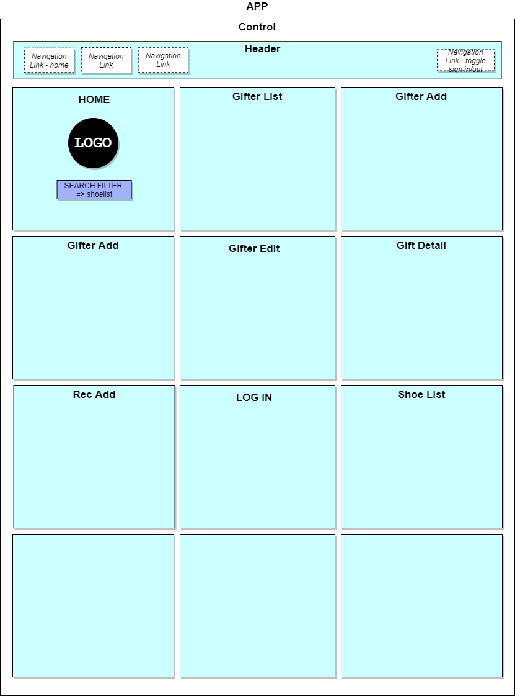

# <h1 align = "center"> `SHUBER`
</h1>
<h4 align="center"> It's like uber but for shoes!  <em>To be clear, in this analogy the shoes are the passengers, you are the destination, and the drivers are the ones selling you shoes.</em></h4>

***
 

  <a href="#key-features">Key Features</a> •
  <a href="#how-to-use">How To Use</a> •
  <a href="#reach-out"> Reach Out </a> •
  <a href="#credits">Credits</a> •
  <a href="#you-may-also-like">Related</a> •
  <a href="#license">License</a>

 

## 👟 `Key Features`

- Login & Logout, Uses Firebase Authorization & Authentication

- User pages displays users data, Tracks User Information (name, member since, location, shoe size, rating, foot width)

- Users can add shoes to database (size, date added, condition, type, brand, uses, foot width) 

- User can see all posted shoes
- User can Edit or Delete shoes
- Recipients can select and add shoes to their cart

## 👢 `Features coming soon`
- Mobile Responsive Site (React Native)
- Google Maps API
- Map shows users real time location
- Ability to upload user images
- Add shopping element/amazon api
- Application differentiates between gifters
- Shoe API
## 🥾 `Wireframe Mockup`

## 👡 `How To Use`

To clone and run this application, you'll need [Git](https://git-scm.com), [NPM](https://www.npmjs.com/get-npm) installed. If you wish to review the raw code, it's easiest to download a code editor such as Visual Studio Code or Atom.

### `Clone this repository from your Command Line:`

`git clone https://github.com/chyoon2/shuber`

* Go into the repository
* Open repository in VS Code or other
* Install dependencies in Root Project Directory.  <em> `"npm install"`<em>

* Run the app. `"npm start"`

## 📪 `Reach Out`

Shuber is an [emailware](https://en.wiktionary.org/wiki/emailware). Meaning, if you liked using this app or it has helped you in any way, we'd like you send us an email at <chy.yoon@gmail.com> about anything you'd want to say about this software. We'd really appreciate it!

## 🏄 `Credits`

This software uses the following technologies:

- Javascript
- React Redux (JSX)
- Firebase/Firestore
- HTML (Bootstrap)
- CSS (Bootstrap)
- Git versioning

## `You may also like...`🛁

-- Other projects in my GitHub Repository
> GitHub [ChristopherYoon](https://github.com/chyoon2)

 

## 📘 `License`

___
 

## `Support`
 

Or

  

---

## Christopher Yoon
> LinkedIn [ChristopherYoon](https://www.https://www.linkedin.com/in/chrisyoonseattle/) &nbsp;&middot;&nbsp;
> GitHub [ChristopherYoon](https://github.com/chyoon2) &nbsp;&middot;&nbsp;
> instagram [Chrisyoonful](https://www.instagram.com/chrisyoonful/?hl=en)